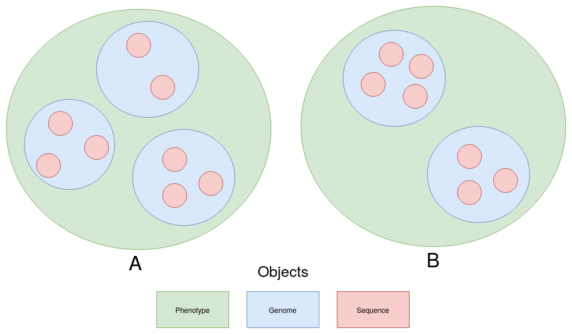

Modules
=========

.. toctree::
   :maxdepth: 4

   args
   genome
   io_utils
   main
   phenotype
   sequence

Object Structure
----------------

- **Phenotype Objects**
   The outermost layer of representation. Instances of Phenotypes have a key \
   which represents their biological phenotype and hold a list of **Genome**
   objects that are classified has having the phenotype of the **Phenotype**
   instance they exist within. Phenotype objects are where phenotype to
   phenotype comparisons take place. Cross **Phenotype** comparison methods
   will take in a one phenotpye instance as an arguement and compare it to the
   phenotype instance the function was called on.

   For example if **Phenotype** class had a method called find_conserved_seqs
   then using the object structure image above it could be used like

   .. code-block:: python

      A.find_conserved_seqs(B)

   And in theory this would return the same result as

   .. code-block:: python

      B.find_conserved_seqs(A)
   

- **Genome Objects**
   **Genome** objects represent an individual bacterial genome sequence. The
   actual sequences are supplied in fasta formated file. Instances have
   functions that do things relating to an individual genome, such as predict
   coding regions and extract non-coding regions.
- **Sequence Objects**
   Currently the innermost form of representation. Sequence objects represent
   a specific nucleotide sequence of interest within a **Genome**. They contain
   methods that would be applied on a specific sequence of a specific genome.
   This includes things like translating to all six reading frames.